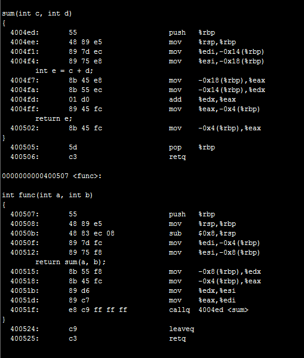
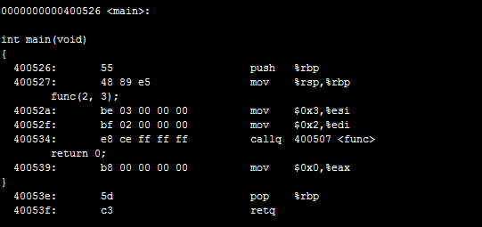
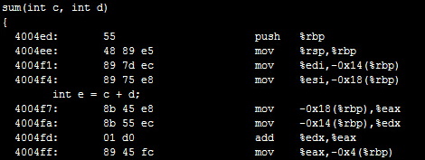

# 函数调用的本质

我们一段代码来研究函数调用的过程。首先我们写一段简单的小程序：

```c
int sum(int c, int d)  
{  
	int e = c + d;  
	return e;  
}  
   
int func(int a, int b)  
{  
	return sum(a, b);  
}  
   
int main(void)  
{  
	func(2,3);  
	return 0;  
}  
```
通过gcc编译。在编译命令中要加上-g选项，这样在使用objdump反汇编时可以把C代码和汇编代码穿插起来显示，这样C代码和汇编代码的对应关系看得更清楚。


要查看编译后的汇编代码，其实还有一种办法是gcc -S main.c，这样只生成汇编代码main.s，而不生成二进制的目标文件。
反汇编的结果比较长，以下只列出主要的部分。





整个程序的执行过程是main调用func，func调用sum。我们从main函数的这里开始看起：


要调用函数func先要把参数准备好，第二个参数保存在esp+4所指向的内存位置，第一个参数保存在esp所指向的内存位置，可见参数是从右向左依次压栈的。然后执行call指令，这个指令有两个作用：

1、func函数调用完之后要返回call的下一条指令继续执行，所以把call的下一条指令的地址0x80483e9压栈，同时把esp的值减4，esp的值现在是0xbf822d18。
2、修改程序计数器eip，跳转到func函数的开头执行。

现在看func函数的汇编代码：


首先将ebp寄存器的值压栈，同时把esp的值再减4，esp的值现在是0xbf822d14，然后把这个值传送给ebp寄存器。换句话说就是把原来ebp的值保存在栈上，然后又给ebp赋了新值。在每个函数的栈帧中，ebp指向栈底，而esp指向栈顶，在函数执行过程中esp随着压栈和出栈操作随时变化，而ebp是不动的，函数的参数和局部变量都是通过ebp的值加上一个偏移量来访问的，例如func函数的参数a和b分别通过ebp+8和ebp+12来访问，所以下面的指令把参数a和b再次压栈，为调用sum函数做准备，然后把返回地址压栈，调用sum函数：


现在看sum函数的指令：



这次又把func函数的ebp压栈保存，然后给ebp赋了新值，指向sum函数栈帧的栈底，通过ebp+8和ebp+12分别可以访问参数c和d。sum函数还有一个局部变量e，可以通过ebp-4来访问。所以后面几条指令的意思是把参数c和d取出来存在寄存器中做加法，add指令的计算结果保存在eax寄存器中，再把eax寄存器存回局部变量e的内存单元。

如果我当前在bar函数中，我可以通过ebp找到bar函数的参数和局部变量，也可以找到func函数的ebp保存在栈上的值，有了func函数的ebp，又可以找到它的参数和局部变量，也可以找到main函数的ebp保存在栈上的值，因此各函数的栈帧通过保存在栈上的ebp的值串起来了。

现在看sum函数的返回指令：


sum函数有一个int型的返回值，这个返回值是通过eax寄存器传递的，所以首先把e的值读到eax寄存器中。然后执行leave指令，这个指令是函数开头的push %ebp和mov %esp,%ebp的逆操作：把ebp的值赋给esp。现在esp所指向的栈顶保存着func函数栈帧的ebp，把这个值恢复给ebp，同时esp增加4。

最后是ret指令，它是call指令的逆操作：

现在esp所指向的栈顶保存着返回地址，把这个值恢复给eip，同时esp增加4。

重复同样的过程，就又返回到了main函数。注意函数调用和返回过程中的这些规则：

- 参数压栈传递，并且是从右向左依次压栈。
- ebp总是指向栈帧的栈底。
- 返回值通过eax寄存器传递。

这些规则并不是体系结构所强加的，ebp寄存器并不是必须这么用，函数的参数和返回值也不是必须这么传，只是操作系统和编译器选择了以这样的方式实现C代码中的函数调用，这称为Calling Convention，除了Calling Convention之外，操作系统还需要规定许多C代码和二进制指令之间的接口规范，统称为ABI（Application Binary Interface）。